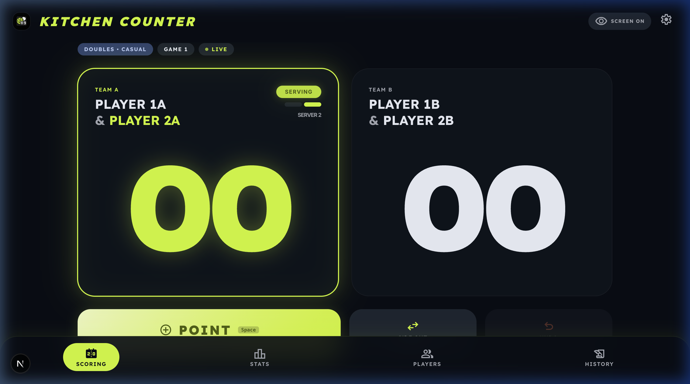
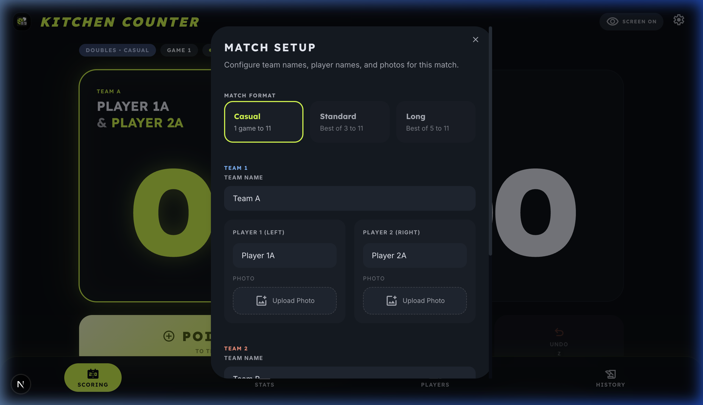
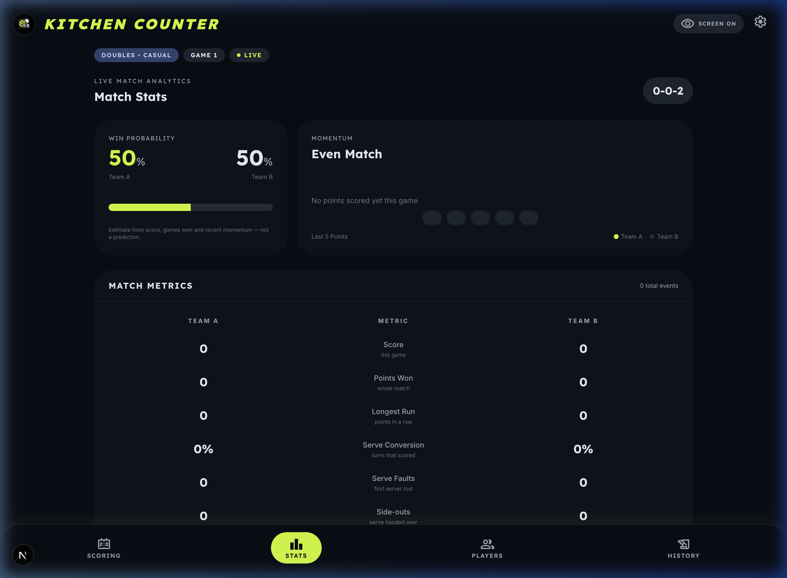
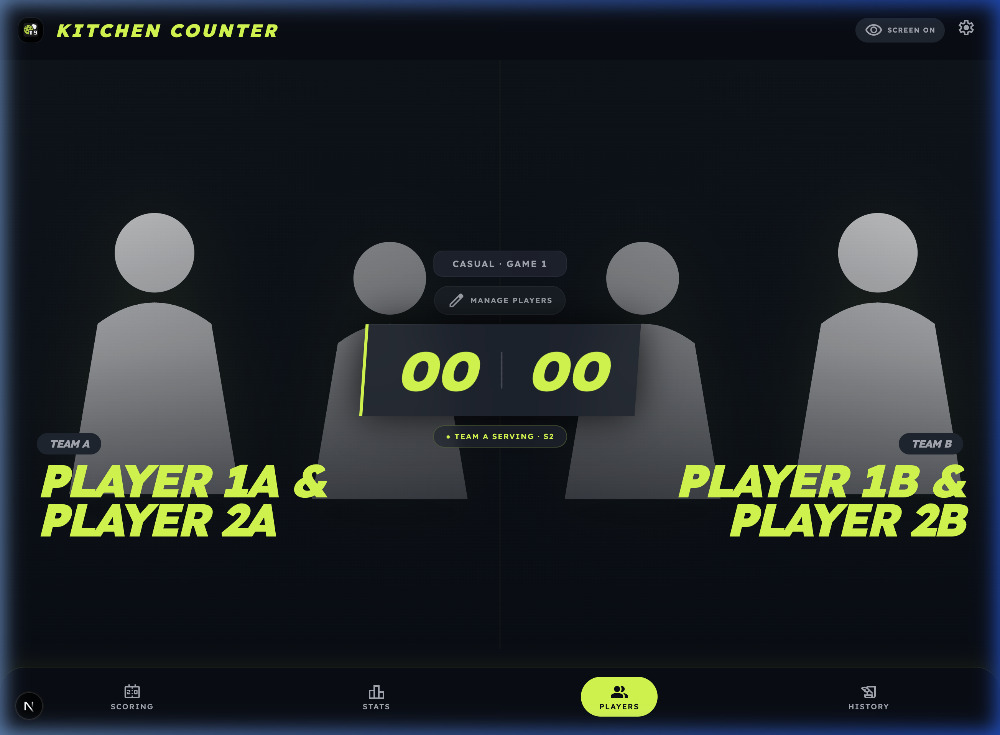
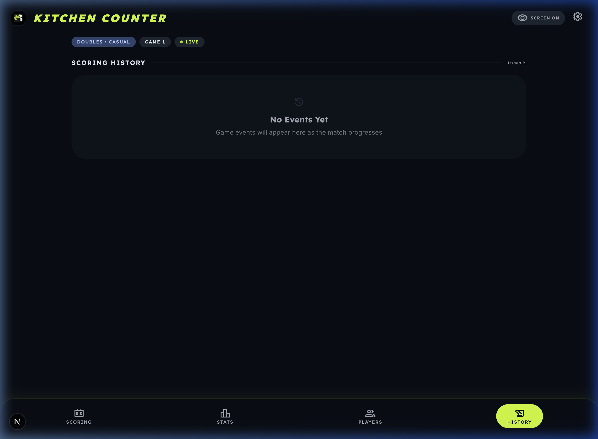
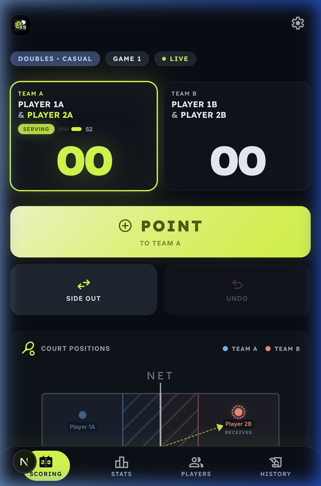
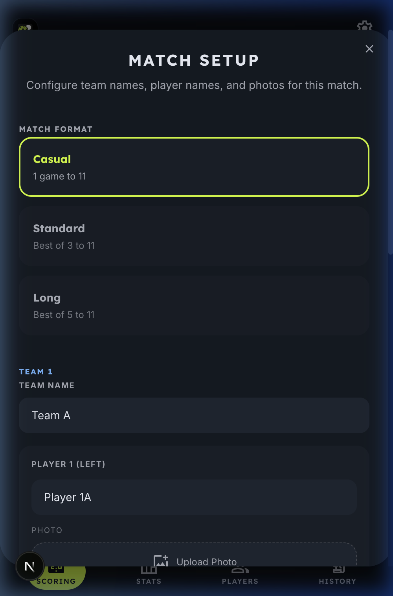
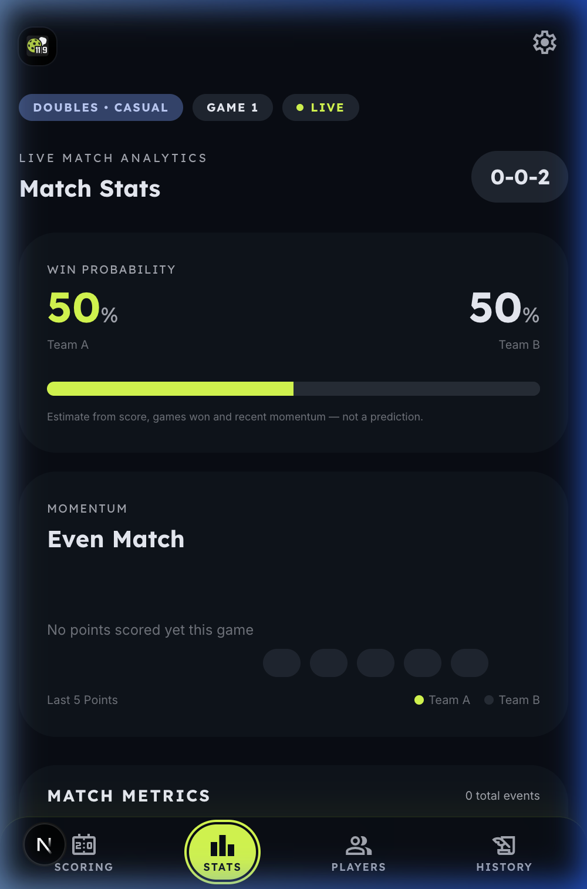
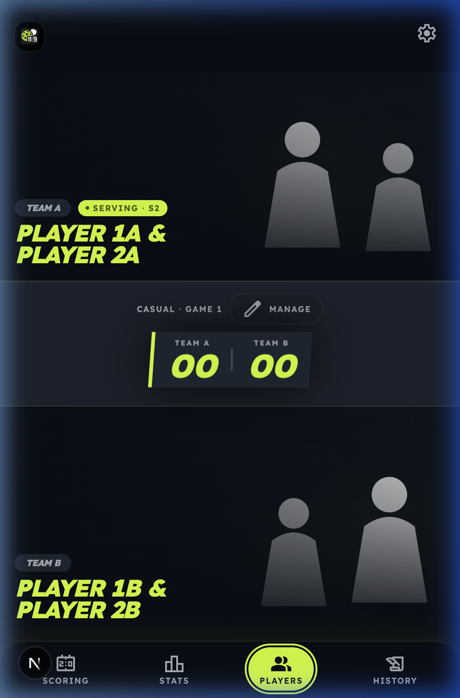
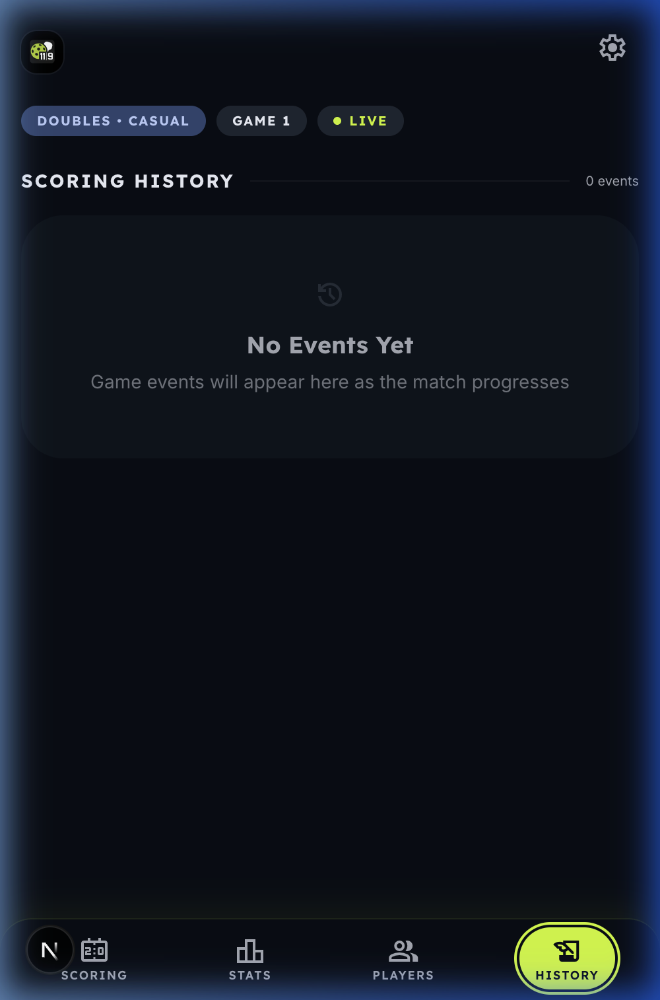

# Kitchen Counter — Pickleball Doubles Scoreboard

<p align="center">
  
</p>

A modern scoreboard app built for **Pickleball Doubles**. It tracks score, server number, player positions on the court, and match analytics — all in real-time from your phone or laptop courtside.

---

## Table of Contents

- [Key Features](#key-features)
- [Screenshots](#screenshots)
- [How to Use](#how-to-use)
- [Keyboard Shortcuts](#keyboard-shortcuts)
- [Scoring Rules](#scoring-rules)
- [Technical Stack](#technical-stack)
- [Getting Started](#getting-started)

---

## Key Features

### Scoring Logic
- **Side-out scoring** — only the serving team scores, per official rules.
- **Server tracking** — tracks Server 1 and Server 2, including the one-server exception on the first serve of each game.
- **Win by two** — games go to 11 with a two-point margin required.
- **Correct server & court** — tracks which partner is serving and from which court.
- **Correct receiver** — highlights the player diagonally opposite the server.

### Match Modes

| Mode | Description |
|------|-------------|
| **Casual** | Single game to 11 (win by 2) |
| **Standard** | Best of 3 games |
| **Long** | Best of 5 games |

### Player & Team Customization
- Custom team and player names
- Upload player photos (stored locally in the browser)
- Real-time court diagram showing player positions

### Live Analytics
- **Win probability** — a heuristic blending score, games won, and momentum
- **Momentum** — which team is winning the last 5 points
- **Scoring streaks** and **longest run** per team
- **Serve conversion** rate
- **Match timeline** — every point, fault, side-out, and game boundary

### UX & Reliability
- **Local persistence** — match state saved to `localStorage`; refresh without losing progress
- **Saved match history** — finished matches are archived on your device and survive a reset
- **Multi-step undo** — step back through the last 25 actions
- **Screen wake lock** — keeps your screen on courtside
- **Keyboard shortcuts** — score without touching the screen
- **Safe reset** — confirmation dialog with restart options
- **Accessible** — live announcements, labelled controls, focus rings, reduced-motion support

---

## Screenshots

### Desktop

<table>
  <tr>
    <td align="center" width="50%">
      
      <br/><strong>Scoring View</strong><br/>
      <em>Main scoreboard with team scores, serving indicator, Point/Side Out/Undo controls, and court diagram.</em>
    </td>
    <td align="center" width="50%">
      
      <br/><strong>Match Setup</strong><br/>
      <em>Configure match format, team names, player names, and upload player photos.</em>
    </td>
  </tr>
  <tr>
    <td align="center" width="50%">
      
      <br/><strong>Stats & Analytics</strong><br/>
      <em>Win probability, momentum tracker, and match metrics comparing both teams.</em>
    </td>
    <td align="center" width="50%">
      
      <br/><strong>Players View</strong><br/>
      <em>Player profiles with avatars, names, score, and serving status.</em>
    </td>
  </tr>
  <tr>
    <td align="center" colspan="2">
      
      <br/><strong>Match History</strong><br/>
      <em>Timeline of every game event — points, faults, side-outs, and game boundaries.</em>
    </td>
  </tr>
</table>

### Mobile

<table>
  <tr>
    <td align="center" width="33%">
      
      <br/><strong>Scoring</strong>
    </td>
    <td align="center" width="33%">
      
      <br/><strong>Match Setup</strong>
    </td>
    <td align="center" width="33%">
      
      <br/><strong>Stats</strong>
    </td>
  </tr>
  <tr>
    <td align="center" width="33%">
      
      <br/><strong>Players</strong>
    </td>
    <td align="center" width="33%">
      
      <br/><strong>History</strong>
    </td>
    <td align="center" width="33%"></td>
  </tr>
</table>

---

## How to Use

### Step 1 — Match Setup


1. Tap the **gear icon** in the top-right corner to open **Match Setup**.
2. **Choose your match format:**
   - **Casual** — Single game to 11 (win by 2). Great for pick-up games.
   - **Standard** — Best of 3 games. The most common competitive format.
   - **Long** — Best of 5 games. For professional-style matches.
3. **Set team names** — enter custom names for Team 1 and Team 2.
4. **Set player names** — each team has Player 1 (Left) and Player 2 (Right).
5. **Upload player photos** *(optional)* — photos are stored locally in your browser.
6. Close the dialog when ready — settings are saved automatically.

---

### Step 2 — Scoring


The **Scoring** tab is the main view you'll use during a game.

- **POINT** — awards a point to the serving team. The label tells you which team scores.
- **SIDE OUT / SECOND SERVER** — ends the current server's turn:
  - Server 1 faults → partner takes over as Server 2.
  - Server 2 faults → Side Out, the other team serves.
  - *Exception:* On the first serve of every game, the serving team starts on Server 2, so their first fault is an immediate side-out.
- **UNDO** — step back through up to 25 recent actions.
- The **SERVING** badge and **S1/S2** indicator show who is currently serving.
- The **court diagram** below shows where each player should be standing.

> **Tip:** On desktop, use keyboard shortcuts for faster scoring — see [Keyboard Shortcuts](#keyboard-shortcuts).

<br clear="right" />

---

### Step 3 — Court Positions

The court diagram updates automatically after every action. It shows:

- Both teams on their respective sides
- The **server** marked with a dot in the correct court (right for even score, left for odd)
- The **receiver** diagonally opposite the server, highlighted with a dashed arrow
- The **kitchen (NVZ)** shown as a hatched area at the net

Use this to confirm everyone is in the right position before serving.

---

### Step 4 — Stats & Analytics


Tap the **Stats** tab to view live match analytics:

- **Win Probability** — real-time estimate based on score, games won, and momentum. Labelled as an estimate, not a prediction.
- **Momentum** — which team is "hot" based on the last 5 points, shown as colored dots.
- **Match Metrics** — side-by-side comparison: score, total points won, longest run, serve conversion rate, faults, and side-outs.
- **Score Badge** — the traditional pickleball score call (e.g., `0-0-2` = serving team score, receiving team score, server number).

---

### Step 5 — Players View


Tap the **Players** tab for a visual overview of all four players:

- Player photos (or default silhouettes) for both teams
- Team and player names
- Current score displayed between the teams
- Serving status indicator
- Tap **"Manage Players"** to edit names or photos

This view works well as a **spectator display** — great for projecting on a big screen courtside.

---

### Step 6 — History


Tap the **History** tab to review the full match timeline:

- Every event is logged: points, faults, side-outs, server changes, game boundaries
- Events listed chronologically with timestamps
- Event counter in the top-right shows total events
- Useful for settling disputes about earlier plays
- In multi-game matches, events are organized by game

Switch to **Past matches** for the archive of finished matches:

- A match is saved the moment it is won, and removed again if you undo that point
- Each card shows the winner, the result, per-game scores, duration, and total points
- The archive survives a reset, so starting a new match no longer loses the old one
- Stored on your device only — up to the 50 most recent matches, deletable one at a
  time or all at once

---

## Keyboard Shortcuts

| Key | Action |
|-----|--------|
| `Space` or `P` | Award a point to the serving team |
| `F` | Fault / Second Server / Side Out |
| `Z` | Undo the last action |
| `N` | Start the next game (after a game is won) |
| `1` | Switch to Scoring tab |
| `2` | Switch to Stats tab |
| `3` | Switch to Players tab |
| `4` | Switch to History tab |

---

## Scoring Rules

Kitchen Counter implements all official pickleball doubles scoring rules:

| Rule | Behaviour |
|------|-----------|
| Side-out scoring | Only the serving team can score a point |
| Game to 11, win by 2 | 11–10 continues; 12–10 wins |
| First serve of a game | Serving team starts on "server 2", so their first fault is a side-out |
| Server rotation | Server 1 fault → partner serves; server 2 fault → side-out |
| Court positions | The serving team swaps sides on every point they win — never on a fault |
| Serving court | First server is on the right when their team's score is even, left when odd |
| Correct receiver | The player diagonally opposite the server |
| Next game | The team that lost the previous game serves first |

---

## Technical Stack

- **Framework:** Next.js 16, React 19, TypeScript
- **Styling:** Tailwind CSS v4 with custom CSS variables
- **State:** Pure reducer in `lib/pickleball-state.ts`, wrapped by `usePickleballGame`
- **Icons:** Google Material Symbols
- **Analytics:** Vercel Analytics
- **Persistence:** Browser `localStorage`

---

## Getting Started

### Prerequisites
- Node.js 18.x or later
- npm, yarn, or pnpm

### Installation

```bash
# Clone the repository
git clone <repository-url>
cd pickleball_scoreboard_doubles

# Install dependencies
npm install

# Run the development server
npm run dev

# Open in your browser
open http://localhost:3000
```

### Production Build

```bash
npm run build
npm run start
```

### Quality Checks

```bash
npm run lint       # ESLint 9 + eslint-config-next (flat config)
npm run typecheck  # tsc --noEmit
```

## License

Released under the [MIT License](LICENSE). Copyright (c) 2026 serocode.

---

Built for the Pickleball community.

<p align="center">
  <strong>Kitchen Counter</strong> — Never lose track of the score again.
</p>
